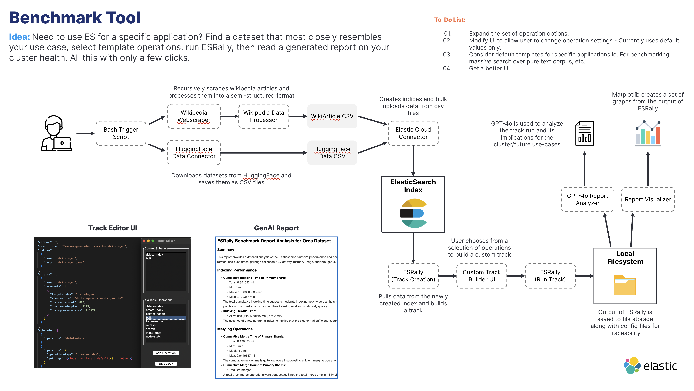
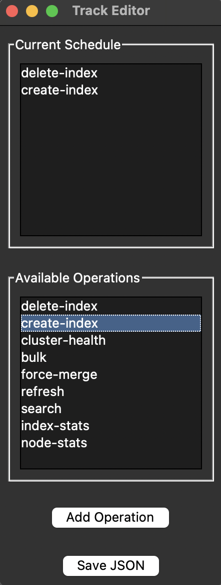
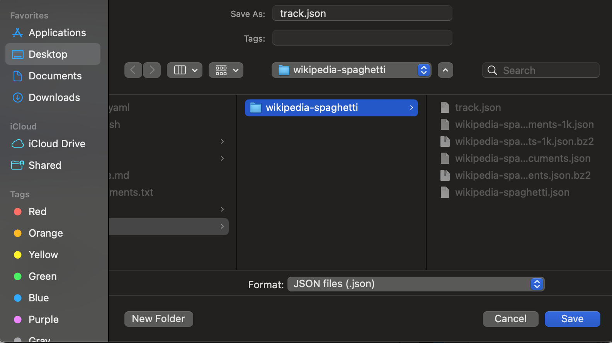
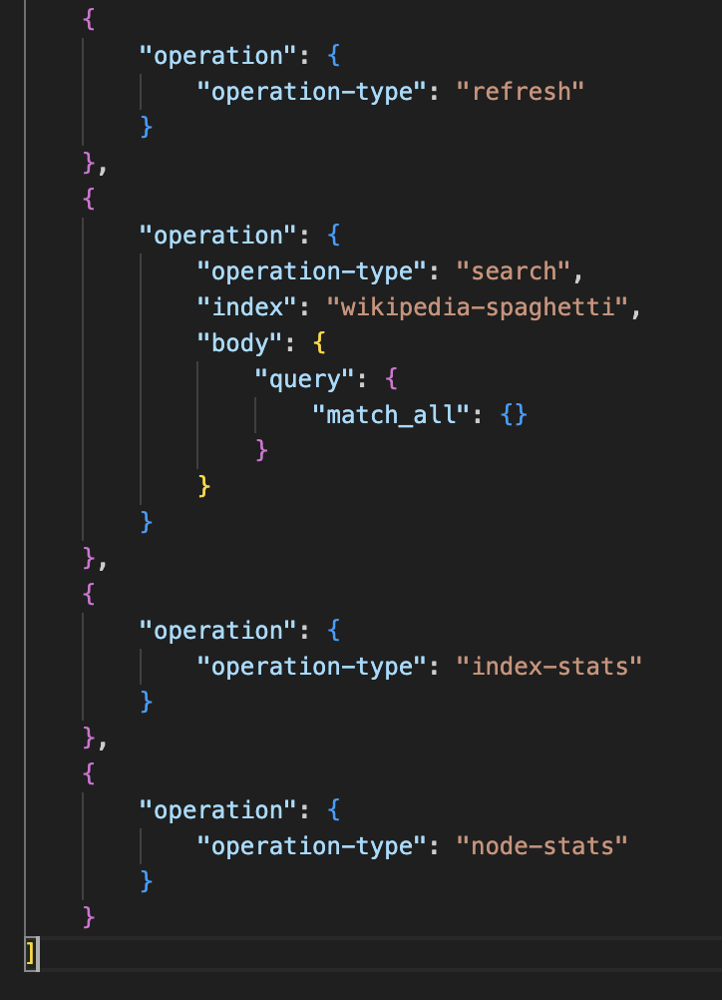

# ESRally Benchmarker Tool

This project aims to simplify the process of creating and running custom tracks for ESRally. 
This was put together once a couple of days for an interview so it is still barebones.
There are janky parts especially in the parts relevant to the ui (./python/ui.py , ./python/esrally_operations.json). What can I say, I had a timelimit x_x
Some QoL improvements  need to be made. Do bear with me, I'll try to make this more convenient going forward.



## Usage

### 1: Prerequisites
To begin, create a virtual python environment and install dependencies:

#### MacOS instructions
```
python -m venv env
source env/bin/activate
pip install -r requirements.txt
```

### 2: Configuration

Navigate to config.yaml and set each setting appropriately. 
Config settings are commented and there are some examples available.
Once config is properly set, run the script with:

```
bash esrally.sh
```

The script will download the data from the chosen source, upload it to your elastic cloud deployment, then run ESRally.
You will be prompted to create a track by selecting some operations:



Select the operations you wish by clicking on each and pressing "Add Operation".

When done, click "Save Json" to save the track.json. Make sure you save it to the appropriate folder in ./tracks/



Close the UI and wait for the script to finish running ESRally, generating visuals, and running GPT 4o to make a report.

### 3: Review

Navigate to ./logs, where a timestamped folder will have been created for your run. An example is provided so you know what to expect.

## Notes:

### Choosing a dataset

For wikiscraping, choose an article that reflects an interest and add the url to config.yaml. 
Imagine a circle expanding from that url and encompassing the wiki urls linked to it. 
max_depth corresponds to the size of that circle, and max_docs is the number of documents within that circle which will be taken. 

For huggingface, choose a dataset that mirrors the size and complexity that you would like to test.
It should work for any datatypes (This is account for in the get_es_field_type function in ./python/hfacedata_collector.py)

### Adding more operations

Operations can be added by adding the appropriate json object to esrally_operations.json in ./python

Note that the current operations are all default values so this needs tweaking. 
In the future I would add an editor to the UI that lets you change the settings for each operation more flexibly. 

For operations that require you to specify an index, don't worry. ./python/ui.py handles this by pulling the index name from track.json at line 121.


